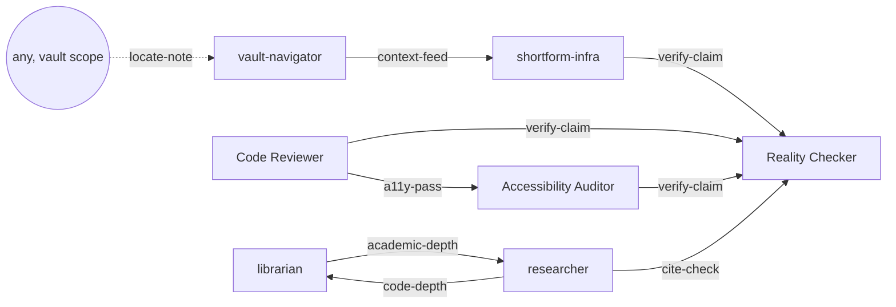

# Agent Graph — canonical topology (v2, 2026-07-03)

Seven curated agents replace the old ~150-file pack (archived at `~/.claude/agents-archive-2026-07-03/`).
Edges are **advisory**: subagents cannot spawn subagents, so the main loop executes handoffs. Every agent's
final message ends with a strict-grammar line — `next: <agent-name> — <one-line reason>` or `next: none`.

## Main-loop protocol (the part that makes edges real)

1. When a subagent report ends with `next: <agent> — <reason>`, treat it as a first-class routing suggestion:
   follow it, or say in one line why not.
2. **Max one utility hop per task** (locate-note edge); never re-dispatch the agent that just reported.
3. Pass forward only the context the next agent needs — never the full transcript (hop bloat).

## Nodes

| Agent | Scope | Role |
|---|---|---|
| vault-navigator | Paramount vault | finds the right notes/context for any vault question |
| shortform-infra | Paramount vault | reasons over Shortform infra (K8s, pipeline, BQ, Pub/Sub) |
| librarian | global | open-source code evidence with GitHub permalinks |
| researcher | global | academic papers, citations, literature synthesis |
| Code Reviewer | global | defect-focused diff/PR review |
| Accessibility Auditor | global | WCAG/keyboard/screen-reader audits |
| Reality Checker | global | adversarial verification of claims; VERIFIED/REFUTED/UNPROVEN |

## Edges

| Edge | Type | Trigger |
|---|---|---|
| vault-navigator → shortform-infra | context-feed | navigator's found notes become infra-reasoning input |
| shortform-infra → Reality Checker | verify-claim | infra conclusions cite live state that should be re-checked |
| Code Reviewer → Reality Checker | verify-claim | review findings rest on unverified claims |
| Code Reviewer → Accessibility Auditor | a11y-pass | the diff touches UI surfaces |
| Accessibility Auditor → Reality Checker | verify-claim | a claimed a11y fix needs independent evidence |
| librarian ↔ researcher | academic-depth / code-depth | question crosses the paper↔code boundary |
| researcher → Reality Checker | cite-check | key claims need adversarial evidence-checking |
| any (vault scope) → vault-navigator | locate-note | utility; max one hop; VN never recommends VN |

## Maintenance

- This file is the single source of truth; each agent's "Report contract (Agent Graph)" section must agree with it.
  Drift check lives in the vault audit checklist ([[2026-07-03 Skills and Agents Audit]]).
- Old pack names still resolve for the three keepers — they kept their original `name:` values
  ("Code Reviewer", "Accessibility Auditor", "Reality Checker"); nothing was renamed.
- Rollback: swap `~/.claude/agents` with `~/.claude/agents-archive-2026-07-03`.
